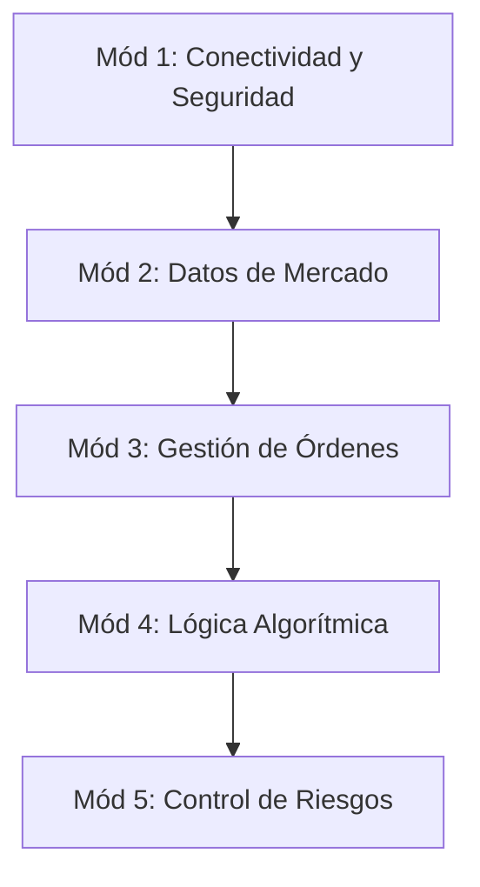

# Bitunix Trading Bot Academy 🎓
### Programa de Aprendizaje: Desarrollo de Bots de Trading de Futuros en Python

Este programa de formación está diseñado para guiar paso a paso a desarrolladores y traders que deseen aprender a programar sus propios sistemas algorítmicos. Utilizaremos como base la API oficial de Bitunix Futures y la arquitectura implementada en este bot.

---

## 🗺️ Estructura del Plan de Estudios

El programa está dividido en **5 módulos progresivos**. Cada módulo incluye teoría, ejemplos prácticos en código y un reto para el estudiante.



---

## 📦 Módulo 1: Conectividad, Autenticación y Firmas Criptográficas

### 💡 Teoría
Para comunicarte de forma segura con un exchange de criptomonedas, no basta con enviar tu API Key. Los servidores de Bitunix requieren autenticar cada solicitud privada mediante una **firma criptográfica** (HMAC-SHA256). Esto garantiza:
1. **Autenticidad**: Que el mensaje proviene realmente de ti.
2. **Integridad**: Que los parámetros de la orden no fueron alterados en el camino.
3. **No repudio**: El timestamp evita que un atacante capture tu petición y la vuelva a enviar (Replay Attacks).

### 🖥️ Ejemplo Práctico
Cómo firmar una petición a Bitunix usando Python:

```python
import time
import hmac
import hashlib
import requests

API_KEY = "tu_api_key"
SECRET_KEY = "tu_secret_key"

def send_signed_request(method, endpoint, params=None):
    base_url = "https://api.bitunix.com"  # O URL de Testnet si aplica
    timestamp = str(int(time.time() * 1000))
    
    # 1. Crear string a firmar (timestamp + método + endpoint + params)
    param_str = ""
    if params:
        # Los parámetros deben ordenarse alfabéticamente para la firma
        sorted_keys = sorted(params.keys())
        param_str = "&".join([f"{k}={params[k]}" for k in sorted_keys])
        
    signature_payload = f"{timestamp}{method.upper()}{endpoint}{param_str}"
    
    # 2. Generar firma HMAC SHA256 cifrada dos veces (estilo Bitunix)
    signature = hmac.new(
        SECRET_KEY.encode('utf-8'),
        signature_payload.encode('utf-8'),
        hashlib.sha256
    ).hexdigest()
    
    # 3. Configurar cabeceras
    headers = {
        "Content-Type": "application/json",
        "api-key": API_KEY,
        "timestamp": timestamp,
        "signature": signature
    }
    
    # 4. Enviar petición
    url = f"{base_url}{endpoint}"
    if method.upper() == "GET":
        resp = requests.get(url, params=params, headers=headers)
    else:
        resp = requests.post(url, json=params, headers=headers)
        
    return resp.json()

# Prueba: Consultar saldo de cuenta
# print(send_signed_request("GET", "/api/v1/futures/account/info"))
```

### 🎯 Reto del Módulo 1
Configura tus variables de entorno usando `python-dotenv` y realiza con éxito tu primera consulta privada de saldo para imprimir en consola tu balance disponible en USDT.

---

## 📊 Módulo 2: Estructura del Libro de Órdenes y Datos de Mercado

### 💡 Teoría
Un bot de trading toma decisiones basadas en el estado del mercado. Los dos flujos de datos más importantes son:
* **Orderbook Depth (Libro de Órdenes)**: La lista de bids (compradores) y asks (vendedores) activos. De aquí calculamos el *Mid Price* (precio medio entre el bid más alto y ask más bajo) y el *Bid-Ask Spread* (la brecha de precio).
* **Klines / Velas Japonesas**: El histórico resumido de precios (Open, High, Low, Close, Volume) en ventanas de tiempo (1m, 5m, 1h). Sirve para calcular indicadores técnicos y volatilidad.

### 🖥️ Ejemplo Práctico
Cómo obtener datos de mercado y calcular el precio medio de cotización:

```python
import requests

def get_market_metrics(symbol="BTCUSDT"):
    url = f"https://api.bitunix.com/api/v1/futures/market/depth"
    params = {"symbol": symbol, "limit": 5}
    
    response = requests.get(url, params=params).json()
    data = response.get("data", {})
    
    bids = data.get("bids", [])  # Lista de [precio, cantidad]
    asks = data.get("asks", [])  # Lista de [precio, cantidad]
    
    if not bids or not asks:
        return None
        
    best_bid = float(bids[0][0])
    best_ask = float(asks[0][0])
    
    mid_price = (best_bid + best_ask) / 2.0
    spread_pct = ((best_ask - best_bid) / mid_price) * 100
    
    print(f"Mejor Compra (Bid): {best_bid}")
    print(f"Mejor Venta (Ask):  {best_ask}")
    print(f"Precio Medio (Mid): {mid_price:.2f}")
    print(f"Spread del Libro:   {spread_pct:.4f}%")
    
    return mid_price

# get_market_metrics()
```

### 🎯 Reto del Módulo 2
Escribe una función que descargue las últimas 20 velas de 1 minuto de `ETHUSDT` y calcule la **desviación estándar** de los precios de cierre. Esta será tu métrica básica de volatilidad.

---

## 🛒 Módulo 3: Colocación de Órdenes y Monitoreo de Posiciones

### 💡 Teoría
Para interactuar con el mercado debes enviar órdenes. En futuros, operamos con apalancamiento y debemos controlar las posiciones existentes:
* **Tipos de Orden**:
  - `LIMIT`: Especificas el precio exacto de ejecución (añades liquidez al libro, pagas menos comisiones).
  - `MARKET`: Se ejecuta de inmediato al mejor precio disponible en el libro (remueves liquidez).
* **Gestión de Posiciones**: Debes monitorear si estás en `LONG` (comprado, te beneficias si sube) o `SHORT` (vendido, te beneficias si baja), y registrar el precio promedio de entrada para calcular el PnL no realizado.

### 🖥️ Ejemplo Práctico
Colocación de órdenes de compra/venta y cierre de emergencia:

```python
# Ejemplo de estructura de parámetros para enviar órdenes (POST)
def place_futures_order(client, symbol, side, qty, price=None, order_type="LIMIT"):
    endpoint = "/api/v1/futures/order/place"
    
    params = {
        "symbol": symbol,
        "side": side.upper(),            # 'BUY' o 'SELL'
        "type": order_type.upper(),      # 'LIMIT' o 'MARKET'
        "qty": str(qty),
        "openClose": "OPEN"              # Abre una posición
    }
    
    if order_type.upper() == "LIMIT":
        if not price:
            raise ValueError("Las órdenes LIMIT requieren un precio.")
        params["price"] = str(price)
        
    return client.send_signed_request("POST", endpoint, params)
```

### 🎯 Reto del Módulo 3
Implementa una función llamada `flash_close()` que consulte tus posiciones abiertas y, si encuentra alguna posición activa, envíe una orden `MARKET` contraria para cerrarla por completo inmediatamente.

---

## 🤖 Módulo 4: Tu primer Algoritmo: Creador de Mercado (Market Maker)

### 💡 Teoría
Un creador de mercado coloca simultáneamente una orden de compra por debajo del precio medio del mercado y una de venta por encima.
* **El objetivo**: Capturar la diferencia de precio (spread) cuando otros traders compran y venden contra tus órdenes.
* **Mantenimiento**: Si el precio del mercado se mueve mucho, tus órdenes se alejarán del centro. El algoritmo debe cancelar las órdenes viejas y recolocarlas (refrescar) basadas en el nuevo Mid Price.

### 🖥️ Diagrama de Flujo del Bot
```
      [Inicio Ciclo]
            │
      Obtener Mid Price
            │
  ¿Precio se movió > Límite?
       ├── SÍ ──> Cancelar Órdenes Activas ──> Colocar Nuevas Órdenes
       └── NO ──> Esperar Intervalo (e.g. 3s)
            │
     [Regresar a Inicio]
```

### 🎯 Reto del Módulo 4
Escribe la lógica del bucle principal de un bot que lea el precio medio de `BTCUSDT` cada 5 segundos. Si el precio actual se desvía más de un 0.1% del precio en el que colocaste tus órdenes virtuales anteriores, imprime en consola: `[BOT] Re-balanceando posiciones: Colocando órdenes a +-0.05%`.

---

## 🛡️ Módulo 5: Gestión de Riesgo (Risk Management) y Simulación

### 💡 Teoría
En el trading algorítmico, **el control del riesgo es más importante que el porcentaje de aciertos**. Debes programar defensas inviolables en tu bot:
* **Stop-Loss (Límite de Pérdida por Posición)**: Si la posición va en tu contra un porcentaje determinado (ej. -2.0% del margen de tu cuenta), el bot debe cerrar la posición asumiendo la pérdida antes de que ocurra una liquidación forzada.
* **Circuit Breaker (Pérdida Diaria Acumulada)**: Si el bot acumula pérdidas acumuladas equivalentes al 10% del capital de la cuenta, debe apagar su bucle de ejecución, cancelar todas las órdenes activas y enviar alertas.

### 🖥️ Ejemplo Práctico
Bucle básico de control de riesgo:

```python
def check_risk_and_margins(realized_pnl, max_pnl_loss, active_position):
    # 1. Circuit Breaker Global
    if realized_pnl <= -max_pnl_loss:
        print(f"🚨 CIRCUIT BREAKER ACTIVADO: Pérdidas de {realized_pnl} USDT superan límite.")
        # Lógica para detener bot y cancelar órdenes
        return "SHUTDOWN"
        
    # 2. Stop-Loss Individual por Posición
    if active_position:
        unrealized_pnl_pct = active_position.get("unrealized_pnl_pct", 0)
        if unrealized_pnl_pct <= -2.0:  # -2%
            print("⚠️ STOP-LOSS ACTIVADO en posición activa. Cerrando...")
            # Lógica para cerrar la posición
            return "CLOSE_POSITION"
            
    return "OK"
```

### 🎯 Reto del Módulo 5
Modifica tu bot de prueba para que lleve un registro de ganancias y pérdidas simuladas. Simula 10 operaciones aleatorias donde el 70% pierde $1.50 y el 30% gana $5.00. Comprueba si el bot sobrevive y calcula la ganancia neta.

---

## 🏫 Consejos para el Instructor (Onboarding de Usuarios)

Al utilizar esta documentación para guiar a nuevos desarrolladores, te sugerimos seguir esta estrategia:

1. **Testnet Primero**: Nunca permitas que los estudiantes utilicen sus API Keys de producción con saldos reales en sus primeras ejecuciones. Utiliza credenciales de simulación (si están disponibles) o programa un modo `dry-run` (simulado) en el bot.
2. **Logs Visuales**: Enfatiza la importancia de los logs coloreados. Un desarrollador debe saber exactamente qué está haciendo el bot en cada segundo de ejecución simplemente mirando la pantalla.
3. **Control de Flujo con Excepciones**: Los exchanges pueden tardar en responder o devolver errores por falta de saldo o congestión de red. Enséñales a envolver cada llamada a la API en bloques `try-except` para que el bot no se caiga ante un error temporal de conexión.
